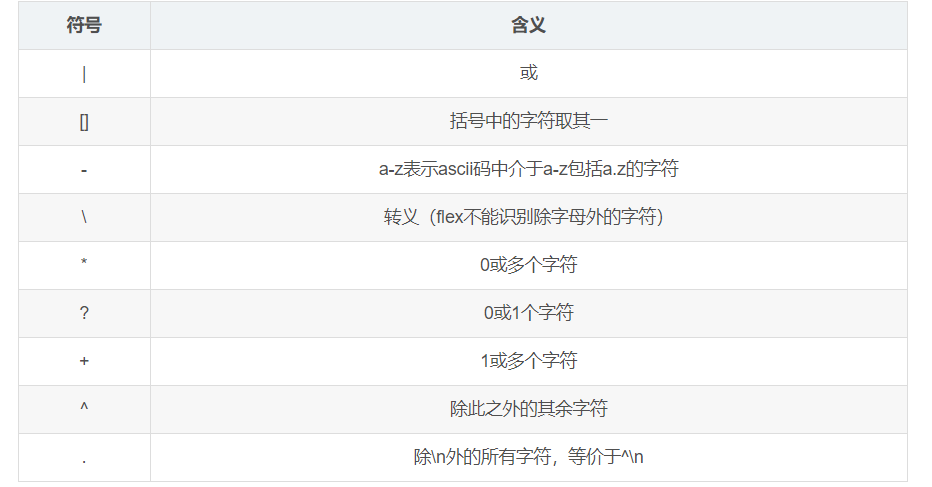
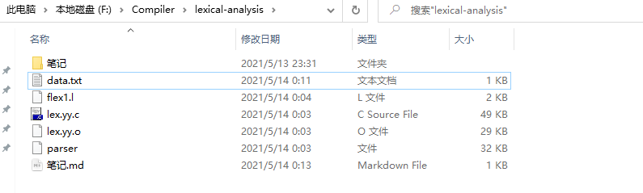

```bash
int 
void
if 
else
while 
break 
continue 
return 
+ 
- 
* 
/ 
%
== 
!= 
< 
> 
<= 
>= 
! 
&& 
|| 
const
[
]
,
;
{
}
(
)
([a-z]|[A-Z]|_)([a-z]|[A-Z]|[0-9]|_)*	#以字母或者下划线开头，标识符

注释：
单行：// 
多行：/* */

数值常量：
十进制：[1-9][0-9]* 		#单独0不匹配在10进制数中，而在8进制中
八进制：0[0-7]*	#
十六进制：0[xX]([0-9]|[a-f]|[A-F])+
```



运行环境：

```bash
ubuntu20.0LTS
$ flex --version
flex 2.6.4
$ gcc --version
gcc (Ubuntu 9.3.0-17ubuntu1~20.04) 9.3.0
Copyright (C) 2019 Free Software Foundation, Inc.
This is free software; see the source for copying conditions.  There is NO
warranty; not even for MERCHANTABILITY or FITNESS FOR A PARTICULAR PURPOSE.
```

运行指令：

```bash
$ flex flex1.l
$ gcc -c lex.yy.c
$ gcc -o parser lex.yy.o -ll
$ ./parser data.txt
```



### 脚本使用方法

```bash
sudo chmod +x test.sh
./test.sh
```

